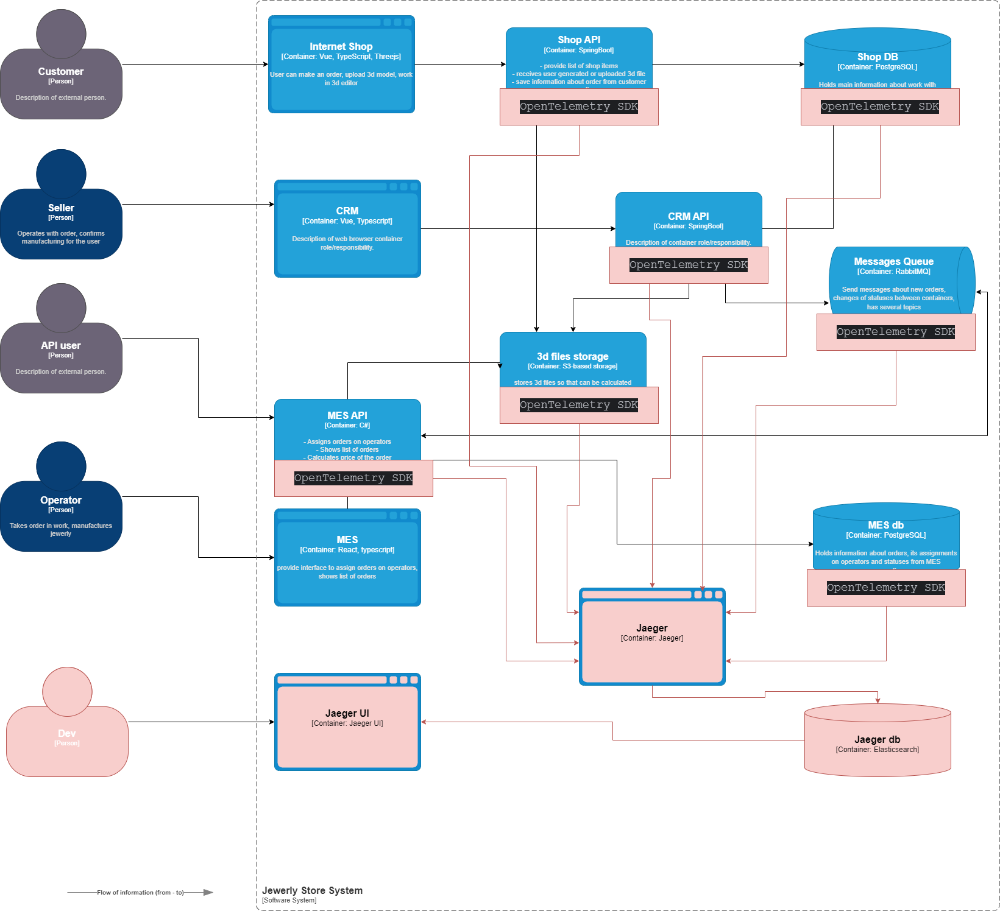

# Данные, которые должны попадать в трейсинг

1. ID запроса. Уникальный идентификатор, который позволяет однозначно идентифицировать запрос.

2. Время начала и окончания запроса. Время, когда запрос был инициирован, и время, когда он был завершён. Это помогает определить длительность запроса.

3. Статус запроса. Текущий статус запроса (например, «выполняется», «завершен», «ошибка»).

4. Ответственный сервис. Сервис или компонент, ответственный за выполнение запроса.

5. Параметры запроса. Любые параметры, переданные с запросом (например, URL, метод, тело запроса).

6. Трассировка стека. Если произошла ошибка, то трассировка стека поможет определить, где именно она произошла.

7. Результат запроса. Успешный или неуспешный результат запроса, а также любые возвращённые данные.

8. Контекст окружения. Информация о среде выполнения запроса (например, среда разработки, тестовая среда, производственная среда).

# Мотивация

**Трейсинг** — это метод, который позволяет отслеживать и анализировать запросы в приложении. Он используется для выявления проблем, оптимизации производительности и улучшения качества кода.

Мотивация для внедрения трейсинга в систему:

1. **Улучшение производительности**. Трейсинг помогает выявить узкие места и оптимизировать работу системы, что способствует повышению общей производительности.
2. **Быстрое обнаружение и устранение проблем**. С помощью трейсинга можно быстро обнаружить и устранить проблемы в работе системы, предотвращая простои и сбои.
3. **Прогнозирование нагрузки**. Анализ данных о работе системы позволяет прогнозировать будущие потребности в ресурсах и планировать масштабирование.
4. **Управление ресурсами**. Понимание того, как работает система, помогает эффективно распределять ресурсы между различными компонентами.
5. **Обеспечение стабильности**. Поддержание стабильной работы системы снижает риск потери данных и доходов из-за простоев.

## Технические и бизнес-метрики решения, на которые повлияет внедрение трейсинга:
1. **Повышение отказоусточивости системы**. Внедрение трейсинга упростит процесс дебага ошибок за счет отслеживания запросов в системе
2. **Улучшение производительности**. Анализ треков позволяет понять, где возникают задержки и узкие места, что помогает оптимизировать ресурсы и улучшить производительность системы
3. **Снижение cреднего времени отклика**. Анализ треков позволяет выявить и устранить узкие места в системе.
4. **Снижение затрат на поддержку и разработку приложения**. 

# Предлагаемое решение

## Список компонентов для внедрения и доработкаи
1. Установка и настройка Elasticsearch
2. Установка и настройка Jaeger
3. Установка и настройка Jaeger UI
4. Интеграция OpenTelemetry SDK в каждый сервис

[Ссылка на Диаграмму контейнеров Александрита](jewerly_c4_model.drawio)

# Компромиссы

Трейсинг может быть неэффективным или слишком дорогим в следующих случаях:

1. **Небольшие проекты**. Для маленьких проектов, где проблемы с производительностью встречаются редко, затраты на внедрение и поддержку трейсинга могут оказаться неоправданными. В таких случаях лучше сосредоточиться на базовых метриках и ручном тестировании.

2. **Простые системы**. В системах с небольшим количеством компонентов и чётко определёнными процессами трейсинг может не дать дополнительной информации, которая существенно улучшит понимание работы системы.

3. **Отсутствие квалифицированных специалистов**. Внедрение и использование трейсинга требуют глубоких знаний и опыта. Если в команде нет специалистов, которые могут эффективно работать с трейсингом, это может привести к неправильным выводам и неэффективному использованию ресурсов.

4. **Сложность интеграции**. Интеграция трейсинга с существующими системами и инструментами может быть сложной задачей, требующей значительных усилий и времени. Это может замедлить процесс разработки и внедрения новых функций.

5. **Проблемы с конфиденциальностью данных**. В некоторых случаях сбор и анализ данных о работе системы может вызвать опасения по поводу конфиденциальности и безопасности данных. Необходимо тщательно продумать меры по защите данных и обеспечить соответствие требованиям регуляторов.

6. **Неопределённые цели**. Без чёткого понимания того, какие проблемы нужно решить с помощью трейсинга, его внедрение может оказаться бесполезным. Важно определить конкретные цели и ожидаемые результаты перед началом работы.

# Аспекты безопасности

Аспекты безопасности при внедрении трейсинга в систему:

1. **Конфиденциальность данных**. Необходимо убедиться, что данные, собираемые во время трейсинга, не содержат конфиденциальной информации, такой как личные данные пользователей или чувствительные бизнес-данные.

2. **Защита от несанкционированного доступа**. Необходимо обеспечить защиту этих трейсинговых данных с помощью шифрования, аутентификации и авторизации.

3. **Управление доступом**. Доступ к трейсинговым данным должен быть строго контролируемым. Только авторизованные пользователи должны иметь возможность просматривать и анализировать эти данные.

4. **Шифрование данных**. Все данные, передаваемые и хранимые в системе трейсинга, должны быть зашифрованы для предотвращения несанкционированного доступа.

5. **Обучение персонала**. Персонал, работающий с системой трейсинга, должен быть обучен основам безопасности данных и понимать риски, связанные с несанкционированным доступом к трейсинговой информации.