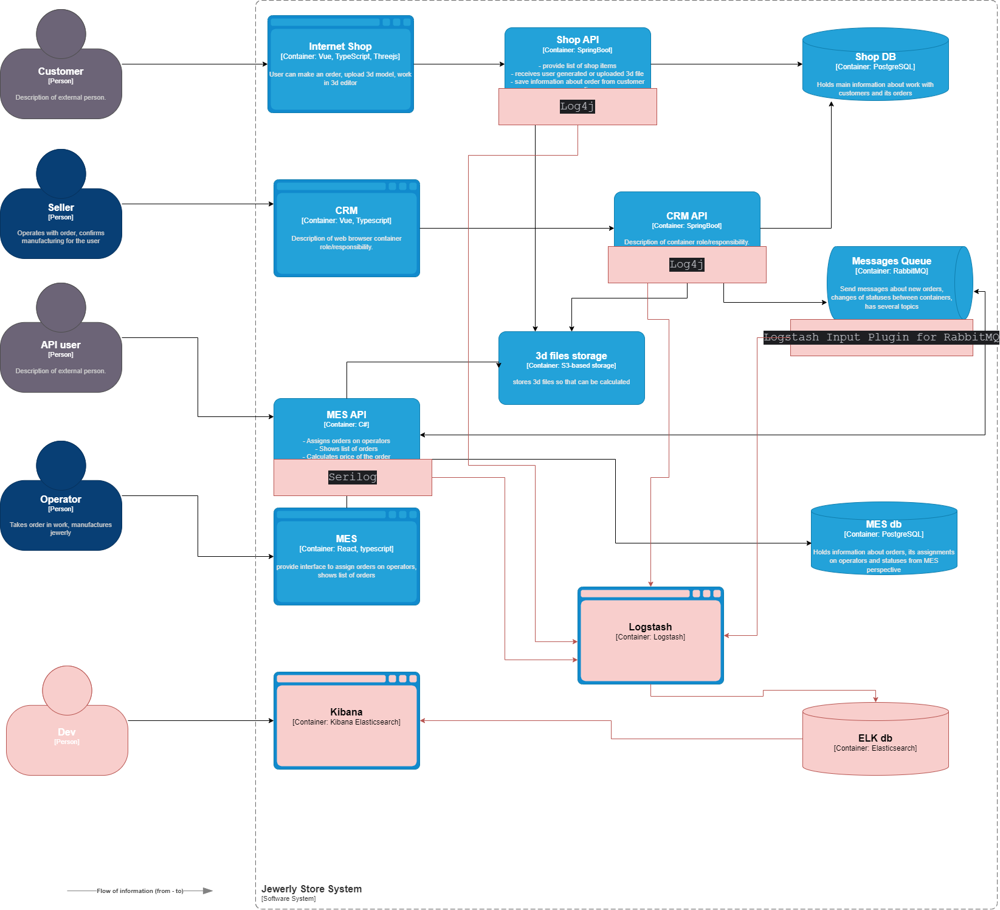

# Анализ системы компании и C4-диаграммы в контексте планирования логирования
## Логи уровня INFO
1. **Онлайн-магазин:**
   * **Пользователь завёл новый заказ или положил товары в пустую корзину**: идентификатор пользователя, идентификатор заказа, время создания заказа, ip адрес пользователя.
   * **Пользователь загрузил файл с 3D-моделью**: Время операции, идентификатор заказа, параметры модели, ip адрес пользователя
   * **Пользователь нажал на кнопку «Сделать заказ»**: Время операции, идентификатор заказа, ip адрес пользователя
2. **CRM:**
   * **Заказ подтверждён**: Время операции, идентификатор заказа
   * **Заказ завершён**: Время операции, идентификатор заказа, сообщение от транспортной компании
3. **MES**:
   * **Изменения статуса заказ**: Время операции, идентификатор запроса, статус операции
   * **Расчет стоимости изделия**: Время начала и\или завершения операции, идентификатор запроса, кол-во полигонов 3D модели 
4. **Бизнес логика**
    * **Выполнение операции**: Время начала и\или завершения операции, идентификатор запроса \ заказа, идентификатор операции, параметры операции
5. **Запросы к API**: Время начала и\или завершения операции, endpoint, идентификатор запроса, параметры запроса
6. **Messages Queue**: Идентификатор topic \ chanel, queue, идентификатор сообщения, producer, consumer, время операции, тип операции 

## Другие уровни логирования
1. **Fatal**: Для всех сервисов и API. Данные: Время, идентификатор сервиса, endpoint, идентификатор запроса, параметры запроса, описание ошибки, трассировка
2. **Error**: Для всех сервисов и API. Данные: Время, идентификатор сервиса, endpoint, идентификатор запроса, параметры запроса, описание ошибки, трассировка
3. **WARN**: Для всех сервисов и API, за исключение prod среды. Данные: Время, идентификатор сервиса, endpoint, идентификатор запроса, параметры запроса, описание, трассировка
4. **DEBUG**: При необходимости, на время разработки сервисов и API, в dev среде. Данные: в зависимости от типа и сложности разработки новой фичи
5. **AUTH**: Для всех сервисов и API. Время, идентификатор сервиса, идентификатор пользователя, входные параметры, за исключением персональных данных, результат операции

# Мотивация
Логирование — это процесс записи информации о событиях, происходящих в системе. Оно позволяет отслеживать работу системы и выявлять проблемы, которые могут возникнуть

Добавление логирования в систему даёт компании следующие преимущества:

1. **Улучшение наблюдаемости**. Логи помогают отслеживать работу системы в реальном времени. Это позволяет быстро выявлять и устранять проблемы, что повышает стабильность и надёжность системы.
2. **Анализ производительности**. С помощью логов можно анализировать производительность системы и определять узкие места, которые замедляют её работу. Это помогает оптимизировать систему и повысить её эффективность.
3. **Отладка кода**. Логи предоставляют информацию о работе кода, что помогает разработчикам отлаживать его и исправлять ошибки. Это снижает риск возникновения сбоев и повышает качество продукта.
4. **Безопасность**. Логи содержат информацию о действиях пользователей и работе системы, что может помочь выявить подозрительную активность и предотвратить атаки.
5. **История изменений**. Логи фиксируют изменения в системе, что позволяет отслеживать историю её развития и понимать, какие изменения были внесены.

## Приоритетные компоненты системы для настройки логирования и трейсинга
1. **MES**: Самое узкое место в системе, наибольшее кол-во жалоб. В то же время, является наиболее критичным компонентом системы, выполняет расчеты стоимости изделий и управляет производственными процессами. Ошибки и простое в MES наиболее критичны
2. **Онлайн-магазин**: Ошибки в работе пользовательской части сайта чреваты имиджевыми потерями для компании, устранение очевидных багов будет способствовать повышению пользовательского опыта
3. **Messages Queue**: Настройка наблюдаемости данного сервиса позволит оценить задержки в работе consumer и устранить \ оптимизировать проблемные операции на стороне consumer сервисов

# Предлагаемое решение

## Технологии:

1. **Система централизованного логирования**. Собирает логи с разных источников в одном месте для удобства анализа и обработки. ELK Stack (Elasticsearch, Logstash, Kibana).
2. **Агенты логирования**. Программы, которые собирают логи с различных источников и отправляют их на сервер централизованной системы логирования. Logstash, в качестве альтернативы Fluentd.
3. **Инструменты агрегации логов**. Объединяют логи из разных источников для создания более полной картины работы системы. Logstash, в качестве альтернативы Fluentd.
4. **Визуализаторы логов**. Преобразуют текстовые логи в наглядные графики и диаграммы для упрощения анализа. Примеры визуализаторов: Kibana, если требуется продвинуты мониторинг и уведомление: Grafana.
5. **Инструменты анализа логов**. Помогают выявлять закономерности и аномалии в логах для улучшения работы системы. Elasticsearch.
6. **Облачное хранилище**. Yandex Cloud для хранения логов на длительный период времени.
7. **Библиотеки логирования**.  это инструменты, которые упрощают процесс записи логов в приложениях. Они предоставляют разработчикам готовые функции для форматирования, фильтрации и анализа логов. Для Java - log4j, C# - Serilog, Logstash Input Plugin for RabbitMQ  

## Список компонентов для внедрения и доработки
1. Установка и настройка ELK
2. Внедрение библиотек логирования Logstash Input Plugin for RabbitMQ, Serilog и log4j
3. Интеграция библиотек логирования с Logstash
4. Настройка визуализации Kibana
5. Настройка облачного хранилища для архивирования логов

[Ссылка на Диаграмму контейнеров Александрита](jewerly_c4_model.drawio)

## Политика хранения логов
Политика хранения логов определяет, как долго логи будут храниться и как они будут архивироваться. Для каждой системы \ сервиса будет использован отдельный индекс.

1. Объём данных:
   * Ограничение объёма хранимых данных до 10 ГБ в неделю
   * Ротация логов ежедневно, еженедельная архивация
2. Частота ротации:
   * Ежедневная ротация для всех типов логов
   * Еженедельная архивация всех логов старше 7 дней
3. Место хранения:
   * Локальный сервер для логов за последние 7 дней
   * Облачное хранилице для логов старше 7 дней. Обязательное шифрование логов при передаче в облачное хранилище
4. Срок хранения:
   * Хранение логов в течение 90 дней для основных типов логов
   * Продление срока хранения до 180 дней для логов AUTH 
5. Политика безопасности:
   * Шифрование при передачи архивных логов в облачное хранилище
   * Хэширование персональных данных 
   * Ограничение доступа сотрудников
   * Обучение персонала

# Необходимые мероприятия для превращения системы сбора логов в систему анализа логов

1. Нотификация:
   * Настройка с помощью Grafana 
   * Варианты уведомлений: Резкий рост кол-ва запросов к одному из сервисов, резкий рост обращений с одного IP. Рост логов уровня Fatal \ Error
2. Визуализация
   * Настройка с помощью Kibana
   * Варианты дашбордов: кол-во обращений к сервису, кол-во ошибок уровня Fatal \ Error, кол-во по статусам ответов отличных от 200, и т.д. 